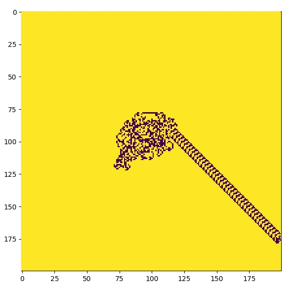
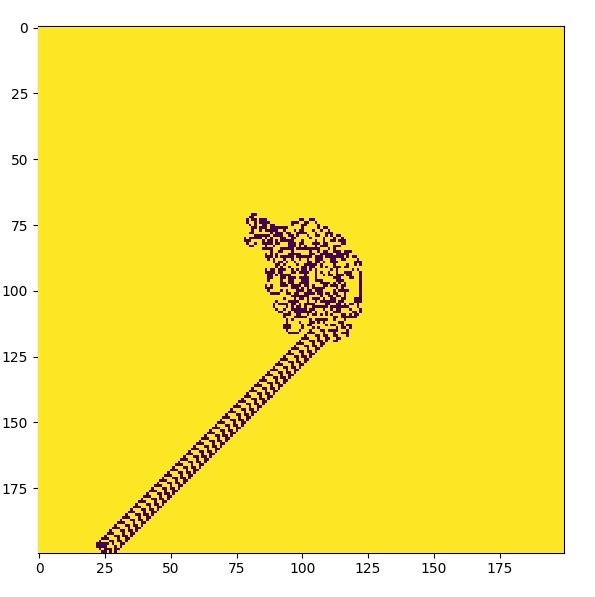

# langton-ant
A Langton's ant simulator in python

## Introduction
[**Langton's ant**](https://en.wikipedia.org/wiki/Langton%27s_ant) is a two-dimensional universal Turing machine 
with a very simple set of rules but complex emergent behavior.  

In simplest term, it's just a cellular automaton like [**Conway's Game of Life**](https://en.wikipedia.org/wiki/Conway%27s_Game_of_Life).  
The ant moves in the grid(cells) following very simple rules. 
The ant has certain orientation in the cell: **up**, **down**, **left**, **right** which is used for turning the direction of the ant.

## Rules
- At a white square, turn 90° right, flip the color of the square, move forward one unit   
- At a black square, turn 90° left, flip the color of the square, move forward one unit


## Usage

### Console Version
Following is the representation in the console:  
- **BLACK** ::  0
- **WHITE** ::  1
- **ANT**   ::  *

#### Single ANT
Run the script `ant.py` for now. You can change the grid size by passing the value during object creation.  

#### Multiple Ant
Run the script `multiant.py` for now. You can change the grid size by passing the value during object creation.  

### Animated Version
Use `animator.py` to run the animated(non-console) version of the simulation. You can pass the number of ants during the 
object's construction.

Make sure you have `matplotlib` installed.

Give total number of ants **n** as an argument to animator script as:
```bash
python animator.py 5
```
This will spawn 5 ants and then run the Langton Ant's simulation. The default value is `2`.

-----

## So, what's interesting?
At first, it might seem unusual due to the random movement of the ant. But that's not it.  
The mind-blowing thing about this is, if you give ant enough time it will eventually move diagonally.  
This behavior is so strange because no matter what initial state you start from, the ant will eventually 
achieve that diagonal state. This is so bizarre, right?  

Here's the snapshot of that behavior with 2 different initial states: 




